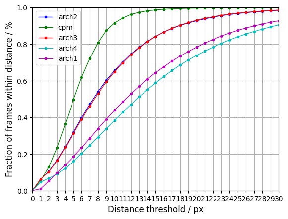

# Attention-A-Lightweight-2D-Hand-Pose-Estimation-Approach-master TEST
#### 任务描述

在手部关键点检测任务中，对论文 **Attention! A Lightweight 2D Hand Pose Estimation Approach**  中提出的Attention Augmented Inverted Bottleneck Block等结构进行测试。
Pytorch版本：https://github.com/hanchenchen/Attention-A-Lightweight-2D-Hand-Pose-Estimation-Approach-Pytorch/tree/main

#### 测评环境

- Ubuntu 16.04.6 LTS
- Python 3.8.5 
- tensorflow 2.4.1

#### 数据集

| [CMU Panoptic][ http://domedb.perception.cs.cmu.edu/handdb.html] | [SHP][https://sites.google.com/site/zhjw1988/] | [FreiHAND Dataset][https://lmb.informatik.uni-freiburg.de/resources/datasets/FreihandDataset.en.html] | [HO3D_v2][https://cloud.tugraz.at/index.php/s/9HQF57FHEQxkdcz?] |
| ------------------------------------------------------------ | ---------------------------------------------- | ------------------------------------------------------------ | ------------------------------------------------------------ |
| 31836                                                        | 36000                                          | 130240                                                       | 66034                                                        |

所有图片剪裁为224*224大小，部分数据集的3D关键点标注投影为2D。

训练样本：验证样本：测试样本 = 80%：10%：10%

#### 测评指标

**PCK**：*Probability of Correct Keypoint within a Nor- malized Distance Threshold*

#### 测试大纲

使用**Convolutional Pose Machines**作为参考的基准，测试论文中提出的architecture是否有良好的性能

采用消融实验方法，对论文中使用的 Attention Augmented Inverted Bottleneck Block、Blur (Pooling Method)、Mish(Activation Function)进行测试。

##### 在原项目的基础上添加如下代码：

train.py: 增加了parser和json配置文件，便于在多个数据库上进行训练。

evaluate.py: 使用PCK指标对模型进行量的测试和质的测试，结果存放在文件夹qualitative_results、quantitative_results。

（dataset_path）/crop_images.py: 将不同数据集中的图片剪裁为特定大小（224），并对labels进行修改

（dataset_path）/make_tfrecord.py: 将不同的数据集制作为tfrecord文件

model_ablation.py + arch.json: 实现了 IV. EVALUATION - B. Ablation studies 中的12种 architectures

model_cpm：使用Convolutional Pose Machines作为基准。

pck.py: 计算PCK。

print_logs.py: 打印训练日志（loss，acc，pck）

compare.py: 比较不同模型的PCK结果。

##### Train

```
python train.py (datatset_name) --arch (1-12/cpm) --GPU 0
```

```
python train.py HO3D_v2 --arch 1 --GPU 0
```

##### Evaluate

```
python evaluate.py (datatset_name) --arch (1-12/cpm) --GPU 0
```


#### 测试结果

##### Ablation Study

在HO3D_v2数据集上，对CPM，Arch1、2、3、4 一共5个模型进行训练，取20个Epoch中val_loss最小的模型进行比较。

 - CPM：baseline, Total params: 15,987,291
 - Arch1：Attention module：1，Pooling Method：Blur, Total params: 1,970,674
 - Arch2：Attention module：0，Pooling Method：Blur, Total params: 1,072,850
 - Arch3：Attention module：0，Pooling Method：Average, Total params: 1,072,850
 - Arch4：Attention module：1，Pooling Method：Average， Total params: 1,970,674



##### Datasets

Architecture1 在不同数据集上的表现，Epoch = 15， 取val_loss最优模型。

（图2 pck）


#### 结果分析
 - 论文提出的结构相较于CPM更加Lightweight。
 - Arch1 的准确率仍然和CPM有较大的差距，考虑如下原因：
    - CPM使用了Heatmap，有利于坐标的学习。论文提出的结构没有使用Heatmap。
 - Arch1 与 Arch2 进行比较，添加了 Self-Attention 结构后反而PCK下降，考虑了如下原因：
    - 原论文中使用了SGD优化器，而 SGD 的缺点在于收敛速度慢，可能在鞍点处震荡。这可能导致了Arch1的loss达到0.06之后便难以下降。
    - Self-Attention的输出与Conv的输出是通过Add合在一起，而不是concatenate，可能是相加的过程中导致信息丢失。
    - Self-Attention 结构可能难以理解有较多障碍物、自我遮挡的数据集（HO3D_v2）。
    - 仅删除了DenseNet结构中的aug_block，保留了最后一层aug_block
 - Blur Pooling 使有 Self-Attention 结构的Arch1 表现优于Arch4；但在无 Self-Attention 结构的Arch2、3中，与Average Pooling 表现相似。

#####Weights

~~https://www.dropbox.com/sh/99u7apw2q52mzn2/AAD0JAmOQ8P4ZK-8VDXDR6xqa?dl=0~~


##### Reference

Santavas N, Kansizoglou I, Bampis L, et al. Attention! a lightweight 2d hand pose estimation approach[J]. IEEE Sensors Journal, 2020. [[code]][https://github.com/nsantavas/Attention-A-Lightweight-2D-Hand-Pose-Estimation-Approach]

Chen Y, Ma H, Kong D, et al. Nonparametric structure regularization machine for 2D hand pose estimation[C]//Proceedings of the IEEE/CVF Winter Conference on Applications of Computer Vision. 2020: 381-390. [code][https://github.com/HowieMa/NSRMhand]

Wei S E, Ramakrishna V, Kanade T, et al. Convolutional pose machines[C]//Proceedings of the IEEE conference on Computer Vision and Pattern Recognition. 2016: 4724-4732.

Simon T, Joo H, Matthews I, et al. Hand keypoint detection in single images using multiview bootstrapping[C]//Proceedings of the IEEE conference on Computer Vision and Pattern Recognition. 2017: 1145-1153. [Panoptic][http://domedb.perception.cs.cmu.edu/handdb.html]

Zimmermann C, Ceylan D, Yang J, et al. Freihand: A dataset for markerless capture of hand pose and shape from single rgb images[C]//Proceedings of the IEEE/CVF International Conference on Computer Vision. 2019: 813-822. [FreiHAND][https://lmb.informatik.uni-freiburg.de/projects/freihand/]

Zhang J, Jiao J, Chen M, et al. 3d hand pose tracking and estimation using stereo matching[J]. arXiv preprint arXiv:1610.07214, 2016. [SHP]

Shivakumar S H, Oberweger M, Rad M, et al. HO-3D: A Multi-User, Multi-Object Dataset for Joint 3D Hand-Object Pose Estimation[J]. arXiv. org e-Print archive, 2019. [HO3D_v2]

